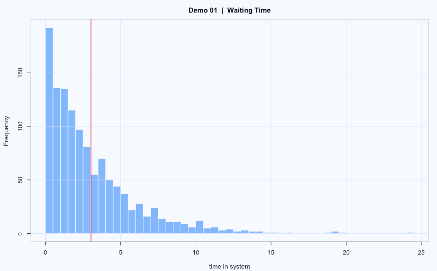

# Demo 01: M/M/1 Cutoff Queue with Bootstrap

## Problem
Estimate the mean system time of accepted customers in an M/M/1 queue with a cutoff-time arrival policy and a queue-capacity rule, then quantify estimator uncertainty with bootstrap.

## Model
- Arrival process: Poisson with rate $\lambda = 4.0$.
- Service times: $S_i \sim \mathrm{Exp}(\mu)$ with $\mu = 4.2$.
- Cutoff time: only arrivals with $t \le T = 8$ are considered.
- Queue rule in code: at most `qthereshold` waiting customers are kept (equivalently, waiting line is truncated).

Target quantity:

$$
\theta = \mathbb{E}[W], \quad W = \text{departure time} - \text{arrival time}.
$$

Bootstrap variance estimate of $\hat\theta$:

$$
\widehat{\mathrm{Var}}(\hat{\theta})
= \mathrm{Var}(\hat{\theta}^{(1)}, \ldots, \hat{\theta}^{(B)}).
$$

## Workflow
1. Simulate arrivals, services, and departures with a discrete-event queue simulation.
2. Compute $W_i$ for all customers who complete service before simulation stops.
3. Estimate $\hat\theta = \frac{1}{n}\sum_{i=1}^n W_i$.
4. Bootstrap-resample $\{W_i\}$ to estimate uncertainty.

## Results

  

- Main outputs: $\hat\theta$ and bootstrap variance (often used as an MSE proxy).
- Full details are in `report.html`.

## Reproduce
- Source report: `report.Rmd`
- Rendered report: `report.html`
