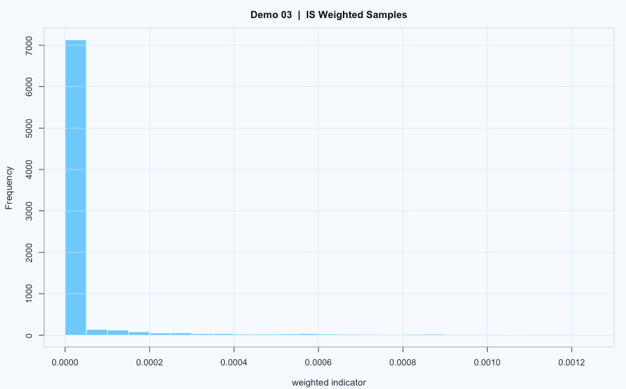

# Demo 03: Rare-Event Importance Sampling

## 教學問題
稀有事件（尾端事件）用直接抽樣會很不穩定，示範如何用 Importance Sampling 改善估計效率。

## 數學模型
以 \(X\sim\text{Exp}(1)\) 的尾端事件為例，常見稀有機率為

\[
p=\mathbb{P}(X>10)=e^{-10}
\]

若改由 proposal \(g(x)\) 抽樣（程式用較厚尾分配），則用權重

\[
w(x)=\frac{f(x)}{g(x)}
\]

形成無偏估計：

\[
\hat\mu_{IS}=\frac{1}{n}\sum_{i=1}^n h(X_i)w(X_i),\quad X_i\sim g
\]

## 解題流程
1. 直接抽樣基準估計（naive）。
2. 用更常抽到尾端的 proposal 抽樣。
3. 套用 likelihood ratio 權重修正偏差。
4. 比較估計值與波動（`sd`、直方圖）。

## 結果與圖表

- `main.R` 會輸出加權估計、標準差與 histogram。
- 你可以直接對照 naive 與 IS 的穩定度差異。

## 如何重現
- 腳本：`main.R`
