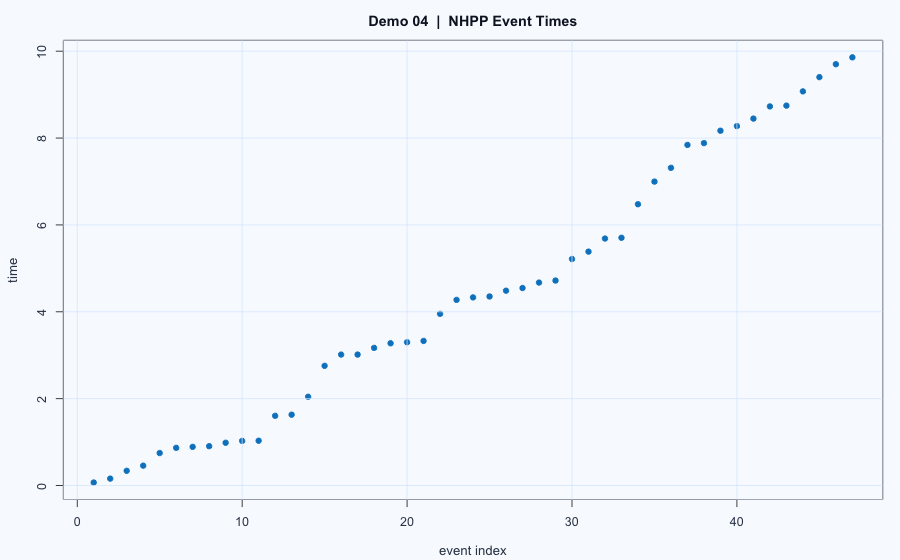

# Demo 04: NHPP Thinning and Gaussian Copula

## Problem
This demo contains two simulation tasks:
1. Simulate event times from a non-homogeneous Poisson process (NHPP).
2. Generate dependent random variables with fixed exponential marginals using a Gaussian copula.

## Model
### (A) NHPP via thinning
Intensity function:

$$
\lambda(t) = 3 + \frac{4}{1+t}, \quad t \in [0,10].
$$

Use upper bound $\bar\lambda = 7$, propose arrivals from a homogeneous process with rate $\bar\lambda$, then accept with probability:

$$
\frac{\lambda(t)}{\bar\lambda}.
$$

### (B) Gaussian copula with exponential marginals
1. Draw correlated Gaussian vector $W$ via Cholesky factorization.
2. Transform to uniforms: $U_j = \Phi(W_j)$.
3. Apply inverse CDFs: $X_j = F_j^{-1}(U_j)$, where $X_1, X_2, X_3$ are exponential with rates $1$, $1/2$, and $1/3$.

## Workflow
1. Simulate NHPP event times using thinning.
2. Simulate copula-based $(X_1, X_2, X_3)$ samples.
3. Check output plots and empirical covariance.

## Results

- NHPP event-time plot and copula simulation outputs are in `report.html`.
- A quick executable version is in `main.R`.

## Reproduce
- Script: `main.R`
- Source report: `report.Rmd`
- Rendered report: `report.html`
