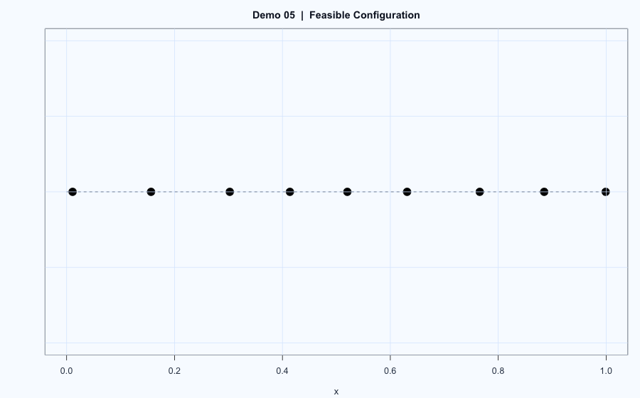

# Demo 05: Constrained Uniform Sampling (MCMC-Style)

## Problem
Sample a 9-dimensional vector in $(0,1)^9$ subject to a hard minimum-distance constraint.

## Model
Target distribution is uniform on the feasible set:

$$
\pi(x) \propto \mathbf{1}\!\left(\min_{i \ne j} |x_i - x_j| \ge 0.1\right),
\quad x \in (0,1)^9.
$$

## Workflow
1. Start from a feasible initial vector.
2. Randomly choose one coordinate $I \in \{1,\dots,9\}$.
3. Propose $y \sim \mathrm{Unif}(0,1)$ for that coordinate.
4. If all pairwise distance constraints remain valid, accept; otherwise resample.
5. Record rejection count (`failtimes`) and iterate.

## Results

  

- Output includes one feasible sample and average rejection count.
- Full run details are in `report.html`.

## Reproduce
- Script: `main.R`
- Source report: `report.Rmd`
- Rendered report: `report.html`
