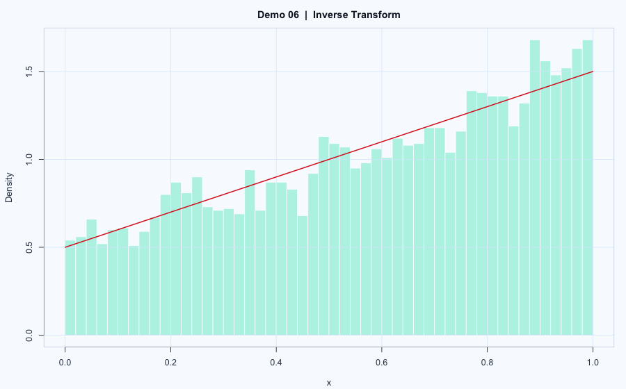

# Demo 06: Random Variate Generation Methods

## Problem
Implement and compare three major random-generation techniques:
- Inverse transform
- Acceptance-rejection (AR)
- Composition (mixture sampling)

## Model
The demo covers three target constructions used in the scripts/reports.

1. Distribution on $[0,1]$ with CDF:

$$
F(x) = \frac{1}{2}(x + x^2), \quad 0 \le x \le 1.
$$

2. Density used for AR experiment:

$$
f(x) = e^{-x} + 2e^{-2x} - 3e^{-3x}.
$$

3. Density on $[0,1]$:

$$
f(x) = \frac{1}{4} + 2x^3 + \frac{5}{4}x^4.
$$

Generic AR acceptance rule:

$$
\text{accept } Y \text{ if } U \le \frac{f(Y)}{M g(Y)},
\quad Y \sim g,\ U \sim \mathrm{Unif}(0,1).
$$

## Workflow
1. Use inverse transform where closed-form inverse is available.
2. Use AR with a simple proposal and acceptance test.
3. Use composition by first selecting mixture component, then sampling conditional on that component.
4. Compare histograms against target shape.

## Results

- `main.R` and `report.Rmd` generate histograms for each method/problem.
- You can compare implementation complexity and sampling efficiency.

## Reproduce
- Script: `main.R`
- Source report: `report.Rmd`
