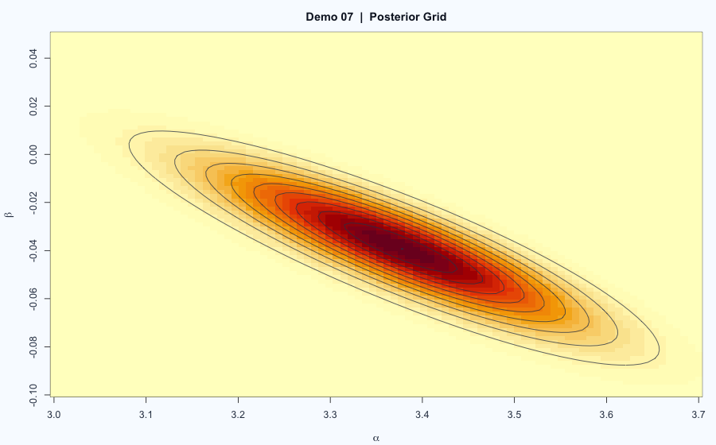

# Demo 07: Bayesian Poisson Trend with Grid Posterior

## 教學問題
示範不用黑箱 MCMC，而是用「網格近似」完成 Bayesian 推論與預測。

## 數學模型
本 demo 有兩段 Bayesian 練習：

### (A) Gamma-Poisson 型後驗（程式前段）
在先驗 \(\theta\sim\text{Gamma}(\alpha,\beta)\) 下，後驗仍為 Gamma，
並可直接求後驗平均、變異與 credible interval。

### (B) Poisson 趨勢模型（程式後段）
對年度事故數 \(y_t\) 設定

\[
y_t\sim\text{Poisson}(\lambda_t),\quad
\lambda_t=\exp(\alpha+\beta x_t)
\]

網格後驗：

\[
p(\alpha,\beta\mid y)\propto \prod_t
\frac{e^{-\lambda_t}\lambda_t^{y_t}}{y_t!}
\]

## 解題流程
1. 在 \((\alpha,\beta)\) 網格上計算未正規化後驗密度。
2. 依權重抽樣近似聯合後驗。
3. 產生 posterior predictive：先抽 \((\alpha,\beta)\)，再抽 \(\tilde y\sim\text{Poisson}(\tilde\lambda)\)。

## 結果與圖表

- 主要圖：後驗等高線、後驗樣本散點、預測分配直方圖。
- 主要輸出：95% credible interval 與預測區間（由程式計算）。

## 如何重現
- 腳本：`main.R`
