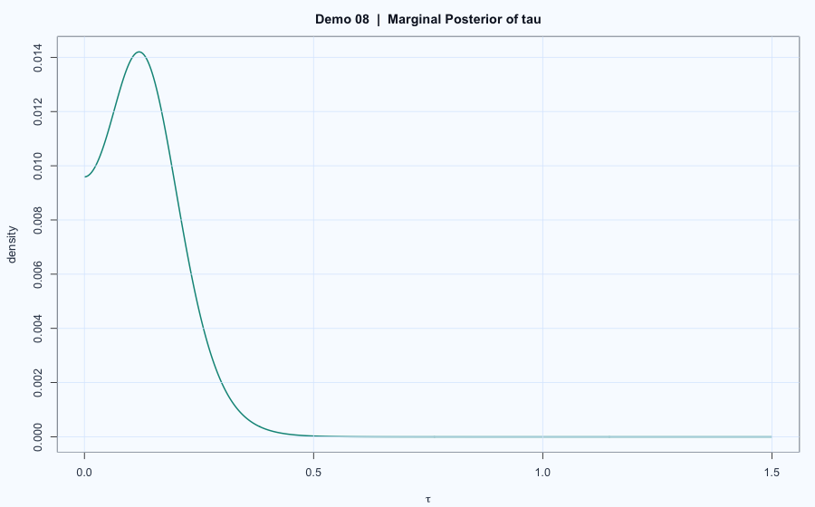

# Demo 08: Bayesian Hierarchical Grid Posterior

## Problem
Show hierarchical Bayes shrinkage using grid-based posterior computation and conditional posteriors.

## Model
This demo includes two hierarchical examples in `report.Rmd`.

### (A) Normal-normal hierarchical model with unknown scale $\tau$

$$
y_j \mid \theta_j \sim \mathcal{N}(\theta_j, \sigma_j^2),
\quad \theta_j \mid \mu,\tau \sim \mathcal{N}(\mu,\tau^2).
$$

The report evaluates the marginal posterior shape of $\tau$ and then summarizes how posterior means/SDs of $\theta_j$ change with $\tau$.

### (B) Hyperparameter grid over $(\alpha,\beta)$
A second hierarchical construction evaluates a grid posterior over hyperparameters and then derives posterior summaries for group-level parameters.

## Workflow
1. Build hyperparameter grid(s) and compute unnormalized posterior values.
2. Normalize to obtain posterior weights.
3. Derive group-level posterior summaries (mean, SD, intervals).
4. Visualize marginal/joint posterior and shrinkage-related summaries.

## Results

- Posterior raster/contour plots and parameter-summary plots are in `report.html`.
- The demo highlights pooling and shrinkage effects.

## Reproduce
- Source report: `report.Rmd`
- Rendered report: `report.html`
