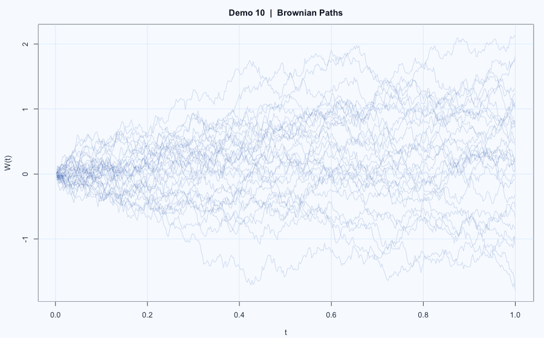

# Demo 10: Brownian First-Passage Probability

## Problem
Estimate the probability that standard Brownian motion crosses below a negative threshold on $[0,1]$, and show discretization effects.

## Model
Target probability:

$$
p(c) = \mathbb{P}\!\left(\min_{0 \le t \le 1} W_t < c\right),
\quad c < 0.
$$

In simulation, divide $[0,1]$ into $m$ steps:

$$
\Delta W_k \sim \mathcal{N}\!\left(0, \frac{1}{m}\right),
\quad W_{k/m} = \sum_{i=1}^k \Delta W_i.
$$

Estimator:

$$
\hat p_m(c) = \frac{1}{N}\sum_{j=1}^N
\mathbf{1}\{\min_{1 \le k \le m} W_{k/m}^{(j)} < c\}.
$$

## Workflow
1. Fix threshold (the script uses `thereshold = -3`, variable name kept as in code).
2. Compare estimates under different grid sizes (for example, `divide = 100` vs `10000`).
3. Examine how finer discretization changes the crossing estimate.

## Results

  

- Path plots and probability estimates are shown in `report.html`.
- You can directly compare coarse-grid and fine-grid estimates.

## Reproduce
- Source report: `report.Rmd`
- Rendered report: `report.html`
